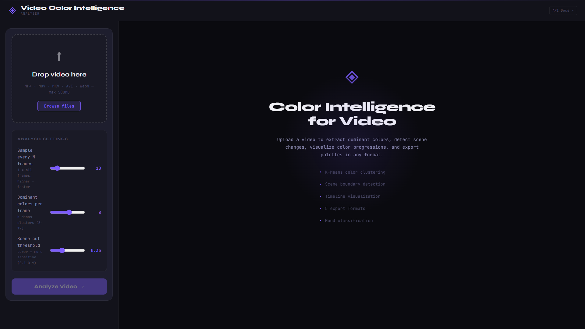
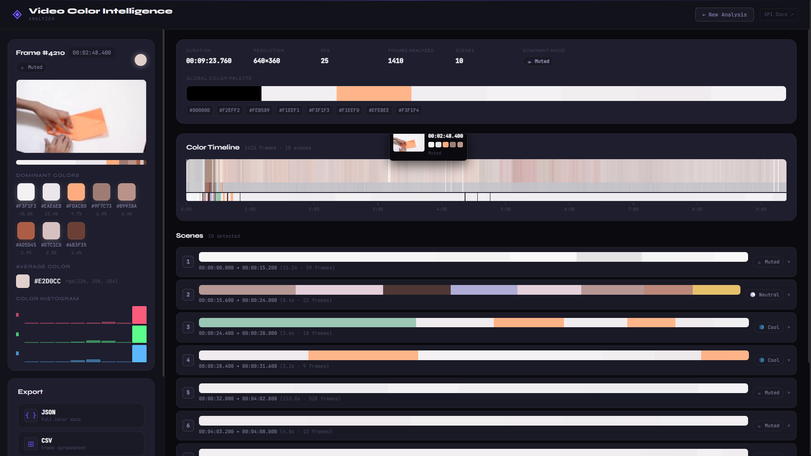

# 🎬 VCIA — Video Content Intelligence & Analysis Platform

> AI-Powered Video Scene Analysis, Segmentation & Export Workflow

VCIA is a full-stack AI-powered video analysis platform built for automated scene detection, frame-level analysis, and intelligent export workflows. It allows users to upload videos, detect scene transitions, analyze video structure, and export meaningful segments for content understanding, editing workflows, and research applications.

---

## 🧠 Tech Stack

| Category | Technology |
|----------|------------|
| Backend | FastAPI |
| Video Processing | OpenCV |
| Server | Gunicorn + Uvicorn |
| Frontend | Vite |
| Deployment | Render |
| Hosting | Vercel |
| Environment | Python 3.11 |
| Version Control | Git + GitHub |

---

## 📌 Introduction

Video content analysis is important for:

- Content summarization
- Automated editing workflows
- Scene segmentation
- Educational content indexing
- Media intelligence systems

Manual video segmentation is slow, repetitive, and difficult to scale. VCIA solves this by providing an automated AI-powered workflow for video scene analysis.

---

## 🎯 Project Objective

Build a complete end-to-end platform that can:

- Upload videos through a web interface
- Read metadata automatically
- Detect scene transitions intelligently
- Analyze frames using OpenCV
- Track progress in real time
- Export useful video segments

---

## 🔧 Core Features

### 🎥 Video Upload System

Upload video files directly from the frontend for automatic analysis. Supports real-world video files including MP4 and common formats.

### 🧠 Scene Detection Engine

The backend performs:

- Frame extraction
- Scene transition detection
- Frame difference analysis
- Content segmentation

...using OpenCV-powered processing.

## 🖼 Screenshots

### Main Upload Interface


### Analysis Progress Dashboard



### 📊 Real-Time Progress Tracking

Users can monitor metadata reading, analysis progress, frame processing, and export workflow in real time.

Example:

```text
Analyzing
abc.mp4
43%
Analyzing frames (612/1410)
```
---

## ☁️ Deployment

### Backend → Render

**Live Backend URL:** [https://vcia-backend.onrender.com](https://vcia-backend.onrender.com)

Configured with: Python 3.11 · FastAPI · Gunicorn · OpenCV

### Frontend → Vercel

Frontend deployed on Vercel and connected via:

```env
VITE_API_URL=https://vcia-backend.onrender.com
```
---

## 🧪 Deployment Validation

The complete workflow was successfully tested end-to-end:

- ✅ Backend deployment
- ✅ Frontend deployment
- ✅ Public cloud access
- ✅ Video upload
- ✅ Metadata reading
- ✅ Frame analysis
- ✅ Scene detection

---

## 📁 Project Structure
vcia/
│
├── backend/
│   ├── main.py
│   ├── requirements.txt
│   ├── .python-version
│   └── render.yaml
│
├── frontend/
│   ├── src/
│   ├── package.json
│   └── vite.config.js
│
├── docs/
├── electron/
└── README.md

---

## ⚠️ Challenges & Resolutions

| Challenge | Resolution |
|-----------|------------|
| Missing `requirements.txt` | Proper GitHub repo restructuring |
| Wrong repo structure | Root directory correction |
| Pillow build failures | Python version pinning (3.11) |
| Python 3.14 incompatibility | Render deployment optimization |

---

## 🚀 Future Scope

- AI-powered semantic scene understanding
- Transcript generation
- Subtitle-aware segmentation
- Highlight detection
- Educational video indexing
- Multi-user production scaling
- Docker + VPS production deployment

---

## 🏁 Conclusion

VCIA successfully delivers a fully deployed AI-powered video analysis system. Unlike academic-only projects, this system was **deployed, tested, and validated in real production conditions**.

> This is not just a model. It is a working product.

---

## 📬 Contact

**Arnav Saxena**
- 🔗 [LinkedIn](https://www.linkedin.com/in/arnav-saxena-a9a217367)
- 📧 [arnav12saxena@gmail.com](mailto:arnav12saxena@gmail.com)
